# Design Document

## Overview

This document describes the technical design for a cross-platform mindmap application built with Flutter UI and Rust core engine. The application provides a high-performance, native-feeling experience across macOS, Windows, and iOS platforms, with a local-first architecture that supports optional cloud synchronization and real-time collaboration features.

The design leverages Flutter's cross-platform capabilities for consistent UI/UX while utilizing Rust's performance and memory safety for core computational tasks including graph algorithms, layout computation, and data persistence.

## Steering Document Alignment

### Technical Standards (tech.md)
*No existing tech.md found - establishing new technical standards:*
- **Language Choice**: Flutter (Dart) for UI layer, Rust for core engine via FFI
- **Architecture Pattern**: Layered architecture with clear separation between UI, business logic, and data layers
- **Performance**: Target 60 FPS rendering with <16ms operation latency
- **Security**: Local-first with end-to-end encryption for optional cloud features
- **Testing**: Comprehensive unit, integration, and end-to-end testing strategy

### Project Structure (structure.md)
*No existing structure.md found - establishing new project organization:*
- **Monorepo Structure**: Separate Flutter app and Rust core in organized directory structure
- **Platform-Specific Code**: Minimal platform-specific implementations using Flutter's platform channels
- **Shared Resources**: Common assets, themes, and configuration files
- **Documentation**: Comprehensive API documentation and architectural decision records

## Code Reuse Analysis

Since this is a greenfield project, there is no existing code to leverage. However, the design establishes patterns for future extensibility and component reuse:

### Foundation Components to Build
- **Base Widget Architecture**: Reusable Flutter widgets following Material Design principles
- **State Management**: Centralized state management using Provider/Riverpod pattern
- **FFI Bridge**: Rust-Flutter interface layer for seamless integration
- **Cross-Platform Services**: Unified API layer abstracting platform-specific functionality

### Integration Points to Establish
- **File System Integration**: Native file picker and storage access across platforms
- **Platform Services**: Integration with iCloud Drive (iOS/macOS), OneDrive (Windows)
- **Input Methods**: Support for keyboard, mouse, touch, and Apple Pencil inputs
- **Export Services**: Integration with platform sharing and printing services

## Architecture

The application follows a layered architecture pattern with clear separation of concerns:

```mermaid
graph TD
    UI[Flutter UI Layer] -->|FFI Bridge| FFI[Flutter-Rust Bridge]
    FFI --> Core[Rust Core Engine]

    subgraph "Flutter Application Layer"
        UI --> Canvas[MindmapCanvas]
        UI --> Widgets[Node Widgets]
        UI --> Search[Search Interface]
        UI --> State[State Management]
        Canvas --> Gestures[Gesture Handling]
        Widgets --> TextEdit[Rich Text Editor]
        State --> LocalCache[Local Cache]
    end

    subgraph "FFI Bridge Layer"
        FFI --> TypeConv[Type Conversion]
        FFI --> ErrorProp[Error Propagation]
        FFI --> MemMgmt[Memory Management]
    end

    subgraph "Rust Core Engine"
        Core --> Graph[Graph Model]
        Core --> Layout[Layout Engine]
        Core --> Persist[Persistence Manager]
        Core --> Sync[CRDT Sync Engine]

        Graph --> Nodes[Node Operations]
        Graph --> Edges[Edge Operations]
        Layout --> Radial[Radial Algorithm]
        Layout --> Tree[Tree Algorithm]
        Layout --> Force[Force-Directed]
        Persist --> SQLite[(SQLite DB)]
        Persist --> Backup[Backup System]
        Sync --> Automerge[Automerge CRDT]
        Sync --> WebSocket[WebSocket Client]
    end

    subgraph "Platform Services"
        UI --> PlatformCh[Platform Channels]
        PlatformCh --> FileAPI[File System API]
        PlatformCh --> CloudAPI[Cloud Storage API]
        PlatformCh --> InputAPI[Input Method API]
        PlatformCh --> ShareAPI[Share/Export API]
    end

    subgraph "Memory Management"
        Core --> NodeVirt[Node Virtualization]
        Core --> LevelDetail[Level of Detail]
        Core --> GC[Garbage Collection]
    end
```



### Memory Management Strategy

For handling large mindmaps (>1000 nodes) efficiently:

#### Node Virtualization System
- **Viewport-Based Rendering:** Only render nodes visible in current viewport plus buffer zone
- **Progressive Loading:** Load node details on-demand as user navigates
- **Smart Caching:** LRU cache for frequently accessed nodes with configurable size limits
- **Background Prefetch:** Intelligent prefetching of adjacent nodes based on user navigation patterns

#### Level-of-Detail Rendering
- **Distance-Based LOD:** Render node details based on zoom level and distance from focus
- **Simplified Rendering:** Use simplified shapes and reduced text for distant nodes
- **Dynamic Quality:** Adjust rendering quality based on device performance and battery level
- **Smooth Transitions:** Animate between detail levels to maintain visual continuity

## Components and Interfaces

### Flutter UI Layer Components

#### MindmapCanvas
- **Purpose:** Main rendering surface for mindmap visualization and interaction
- **Interfaces:**
  - `void renderMindmap(MindmapData data)`
  - `void handleGesture(GestureEvent event)`
  - `NodeSelection getSelectedNodes()`
- **Dependencies:** CustomPainter, GestureDetector, RustCore
- **Reuses:** Base Flutter Canvas and Animation frameworks

#### NodeWidget
- **Purpose:** Individual node representation with text editing and styling capabilities
- **Interfaces:**
  - `void editText(String text)`
  - `void applyStyle(NodeStyle style)`
  - `void showAttachments(List<Attachment> attachments)`
- **Dependencies:** TextField, RichText, GestureDetector
- **Reuses:** Material Design text input components

#### LayoutController
- **Purpose:** Manages layout algorithms and smooth transitions between different layout modes
- **Interfaces:**
  - `void switchLayout(LayoutType type)`
  - `void animateTransition(Duration duration)`
  - `Position calculateNodePosition(Node node)`
- **Dependencies:** AnimationController, RustCore layout engine
- **Reuses:** Flutter animation framework

#### SearchInterface
- **Purpose:** Provides fuzzy search functionality with real-time results
- **Interfaces:**
  - `Stream<List<SearchResult>> search(String query)`
  - `void navigateToNode(String nodeId)`
  - `void highlightMatches(List<String> nodeIds)`
- **Dependencies:** TextField, ListView, RustCore search
- **Reuses:** Material Design search components

### Rust Core Engine Components

#### GraphModel
- **Purpose:** Core data structure for mindmap representation with nodes and edges
- **Interfaces:**
  - `Result<NodeId, Error> add_node(Node node, Option<NodeId> parent)`
  - `Result<(), Error> update_node(NodeId id, NodeUpdate update)`
  - `Result<(), Error> add_edge(Edge edge)`
  - `Vec<Node> get_children(NodeId parent_id)`
- **Dependencies:** SQLite persistence, CRDT synchronization
- **Reuses:** Rust standard collections and error handling

#### LayoutEngine
- **Purpose:** Computes node positions using various layout algorithms
- **Interfaces:**
  - `LayoutResult calculate_radial_layout(Graph graph, Config config)`
  - `LayoutResult calculate_tree_layout(Graph graph, Config config)`
  - `LayoutResult calculate_force_layout(Graph graph, Config config)`
- **Dependencies:** Mathematical computation libraries
- **Reuses:** Rust mathematical computation crates (nalgebra, petgraph)

#### PersistenceManager
- **Purpose:** Handles local data storage, auto-save, and backup functionality
- **Interfaces:**
  - `Result<(), Error> save_mindmap(MindmapId id, Graph graph)`
  - `Result<Graph, Error> load_mindmap(MindmapId id)`
  - `Result<(), Error> create_backup(MindmapId id)`
- **Dependencies:** SQLite database, file system access
- **Reuses:** rusqlite, serde for serialization

#### SyncEngine
- **Purpose:** Manages CRDT-based synchronization and conflict resolution using Automerge
- **Interfaces:**
  - `Result<(), Error> sync_with_remote(RemoteEndpoint endpoint)`
  - `Result<Resolution, Error> resolve_conflicts(Vec<Conflict> conflicts)`
  - `Stream<SyncEvent> subscribe_to_changes()`
  - `Result<MergeResult, Error> merge_documents(Vec<AutomergeDoc> docs)`
- **Dependencies:** Automerge CRDT library, WebSocket connections, tokio runtime
- **Reuses:** automerge-rs crate, tokio for async operations

**CRDT Implementation Details:**
- **Library Choice:** Automerge (selected for Rust-native implementation and strong consistency guarantees)
- **Conflict Resolution:** Automatic text merging with last-writer-wins for metadata
- **Network Protocol:** WebSocket-based with incremental sync patches
- **Offline Support:** Full offline editing with sync reconciliation on reconnection

### FFI Bridge Architecture

The Flutter-Rust integration uses a carefully designed FFI bridge to ensure type safety and performance:

#### FFIBridge Component
- **Purpose:** Provides type-safe interface between Dart and Rust with error handling
- **Interfaces:**
```rust
#[flutter_rust_bridge::frb(sync)]
pub trait MindmapFFI {
    // Node Operations
    fn create_node(&self, parent_id: Option<String>, text: String) -> Result<String, BridgeError>;
    fn update_node_text(&self, node_id: String, text: String) -> Result<(), BridgeError>;
    fn delete_node(&self, node_id: String) -> Result<(), BridgeError>;
    fn get_node_children(&self, node_id: String) -> Result<Vec<NodeData>, BridgeError>;

    // Layout Operations
    fn calculate_layout(&self, layout_type: LayoutType) -> Result<LayoutResult, BridgeError>;
    fn update_node_position(&self, node_id: String, x: f64, y: f64) -> Result<(), BridgeError>;

    // Search Operations
    fn search_nodes(&self, query: String) -> Result<Vec<SearchResult>, BridgeError>;

    // File Operations
    fn save_mindmap(&self, path: String) -> Result<(), BridgeError>;
    fn load_mindmap(&self, path: String) -> Result<MindmapData, BridgeError>;
    fn export_mindmap(&self, path: String, format: ExportFormat) -> Result<(), BridgeError>;
}
```

#### Error Handling Strategy
```rust
#[derive(Debug, Clone)]
pub enum BridgeError {
    NodeNotFound(String),
    InvalidOperation(String),
    FileSystemError(String),
    SerializationError(String),
    LayoutComputationError(String),
}
```

#### Type Conversion Mapping
- **Dart ↔ Rust ID Mapping:** String UUIDs for cross-language compatibility
- **Position Data:** f64 coordinates for precision across platforms
- **Text Data:** UTF-8 string handling with proper encoding validation
- **Binary Data:** Uint8List for file attachments and image data

#### Performance Characteristics
- **Synchronous Operations:** Node CRUD operations (<1ms typical)
- **Asynchronous Operations:** Layout computation and file I/O (background threads)
- **Memory Management:** Automatic cleanup of temporary objects across FFI boundary
- **Error Propagation:** Structured error types with detailed context information

## Platform Integration Architecture

### Platform-Specific Services

#### File System Integration
```dart
// Flutter Platform Channel Interface
class PlatformFileService {
  static const MethodChannel _channel = MethodChannel('mindmap/file_service');

  // Cross-platform file operations
  Future<String?> pickFile(List<String> allowedExtensions) async;
  Future<String?> saveFile(String suggestedName, Uint8List data) async;
  Future<bool> shareFile(String path, String mimeType) async;
}
```

#### Cloud Storage Integration
```dart
// Platform-specific cloud storage
abstract class CloudStorageService {
  Future<void> uploadMindmap(String localPath, String cloudPath);
  Future<void> downloadMindmap(String cloudPath, String localPath);
  Stream<SyncStatus> watchForChanges(String cloudPath);
}

// iOS/macOS: iCloud Drive implementation
class ICloudStorageService extends CloudStorageService { ... }

// Windows: OneDrive implementation
class OneDriveStorageService extends CloudStorageService { ... }
```

#### Input Method Integration
```dart
// Platform-specific input handling
class PlatformInputService {
  // Apple Pencil support (iOS only)
  Stream<PencilEvent> get pencilEvents;

  // Keyboard shortcuts (platform-adaptive)
  void registerShortcut(String key, VoidCallback callback);

  // Context menus (native look and feel)
  void showContextMenu(Offset position, List<MenuItem> items);
}
```

## Data Models

### Node Model
```rust
#[derive(Serialize, Deserialize, Clone)]
pub struct Node {
    pub id: NodeId,                    // UUID v4 identifier
    pub parent_id: Option<NodeId>,     // Parent node reference
    pub text: String,                  // Rich text content
    pub style: NodeStyle,              // Visual styling information
    pub position: Position,            // X, Y coordinates
    pub attachments: Vec<Attachment>,  // Associated files/links
    pub tags: Vec<String>,             // User-defined tags
    pub created_at: DateTime<Utc>,     // Creation timestamp
    pub updated_at: DateTime<Utc>,     // Last modification timestamp
    pub metadata: HashMap<String, Value>, // Extensible metadata
}
```

### Edge Model
```rust
#[derive(Serialize, Deserialize, Clone)]
pub struct Edge {
    pub id: EdgeId,                    // UUID v4 identifier
    pub from_node: NodeId,             // Source node reference
    pub to_node: NodeId,               // Target node reference
    pub edge_type: EdgeType,           // Parent-child, cross-link, etc.
    pub label: Option<String>,         // Optional edge label
    pub style: EdgeStyle,              // Visual styling information
    pub created_at: DateTime<Utc>,     // Creation timestamp
}
```

### MindmapDocument Model
```rust
#[derive(Serialize, Deserialize, Clone)]
pub struct MindmapDocument {
    pub id: MindmapId,                 // Document identifier
    pub title: String,                 // Document title
    pub root_node: NodeId,             // Root node reference
    pub nodes: HashMap<NodeId, Node>,  // All nodes in the mindmap
    pub edges: HashMap<EdgeId, Edge>,  // All edges in the mindmap
    pub view_state: ViewState,         // Current view configuration
    pub settings: MindmapSettings,     // Document-specific settings
    pub version: u64,                  // Version for CRDT operations
    pub created_at: DateTime<Utc>,     // Creation timestamp
    pub updated_at: DateTime<Utc>,     // Last modification timestamp
}
```

### StyleSystem Models
```rust
#[derive(Serialize, Deserialize, Clone)]
pub struct NodeStyle {
    pub background_color: Color,       // Node background color
    pub text_color: Color,             // Text color
    pub border_color: Color,           // Border color
    pub border_width: f32,             // Border thickness
    pub font_family: String,           // Font family name
    pub font_size: f32,               // Font size in points
    pub font_weight: FontWeight,       // Bold, normal, etc.
    pub shape: NodeShape,              // Rectangle, ellipse, etc.
    pub padding: EdgeInsets,           // Internal padding
    pub icon: Option<IconData>,        // Optional icon
}
```

## Error Handling

### Error Scenarios

1. **File System Access Errors**
   - **Handling:** Graceful degradation with user notification and retry mechanisms
   - **User Impact:** Non-blocking error messages with alternative action suggestions
   - **Recovery:** Automatic fallback to in-memory storage with periodic save attempts

2. **FFI Communication Failures**
   - **Handling:** Panic recovery and state reconstruction from last known good state
   - **User Impact:** Brief loading indicator during recovery, minimal data loss
   - **Recovery:** Automatic retry with exponential backoff, manual refresh option

3. **Layout Computation Overflow**
   - **Handling:** Fallback to simpler layout algorithms for large graphs (>1000 nodes)
   - **User Impact:** Performance warning with option to simplify view or break into subgraphs
   - **Recovery:** Progressive loading and level-of-detail rendering

4. **Data Synchronization Conflicts**
   - **Handling:** CRDT-based automatic conflict resolution with user notification for complex conflicts
   - **User Impact:** Merge UI for resolving conflicting edits when automatic resolution fails
   - **Recovery:** Version history with ability to revert to previous states

5. **Memory Pressure on Large Mindmaps**
   - **Handling:** Intelligent node virtualization and progressive loading
   - **User Impact:** Smooth performance with background loading indicators
   - **Recovery:** Dynamic memory management with garbage collection of off-screen nodes

## Testing Strategy

### Unit Testing
- **Rust Core Testing:** Comprehensive property-based testing using PropTest for graph operations
- **Widget Testing:** Flutter widget tests for all custom components with golden file testing
- **Model Testing:** Serialization/deserialization tests for all data models
- **Algorithm Testing:** Performance benchmarks for layout algorithms with various graph sizes

### Integration Testing
- **FFI Testing:** End-to-end tests for Rust-Flutter communication layer
- **Platform Testing:** Automated testing on all target platforms (macOS, Windows, iOS)
- **File Format Testing:** Round-trip testing for all import/export formats
- **State Management Testing:** Integration tests for state synchronization between UI and core

### End-to-End Testing
- **User Journey Testing:** Complete user workflows from mindmap creation to export
- **Performance Testing:** Load testing with large mindmaps (10,000+ nodes)
- **Cross-Platform Testing:** Feature parity validation across all supported platforms
- **Accessibility Testing:** Screen reader compatibility and keyboard navigation testing

### Testing Infrastructure
- **Automated CI/CD:** GitHub Actions for continuous testing across platforms
- **Device Testing:** Integration with platform-specific testing services (Xcode Cloud, Firebase Test Lab)
- **Performance Monitoring:** Automated performance regression detection
- **Code Coverage:** Minimum 90% coverage requirement for core Rust modules, 85% for Flutter widgets